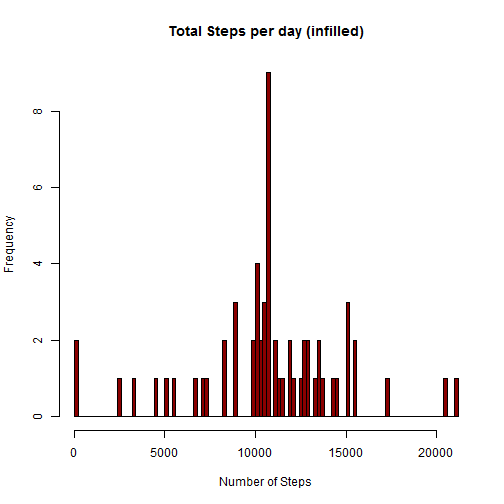
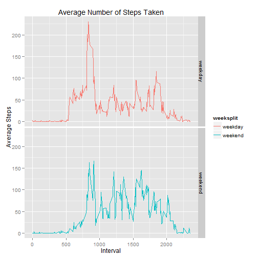

Reproducible Research Peer Assignement 1
========================================================


This assignment makes use of data from a personal activity monitoring device. This device collects data at 5 minute intervals through out the day. The data consists of two months of data from an anonymous individual collected during the months of October and November, 2012 and include the number of steps taken in 5 minute intervals each day.


To download the data click on this link:

[Activity monitoring data](https://d396qusza40orc.cloudfront.net/repdata%2Fdata%2Factivity.zip)


The dataset includes:

- steps: Number of steps taking in a 5-minute interval
- date
- interval


1. Total Number of steps taken per day
---------------------------------------------------------------------

Histogramm of total number of steps taken per day.

```r
library(knitr)
#Set your working directory where the downloaded file is and read in dataset.
setwd("\\\\SEAMS/DFS/HomeDirs/CLauper/R/Courseara/Course4ReproducibleResearch/Week2/repdata-data-activity")
d.activity <- read.csv(file = "activity.csv", na.strings="NA", header=T)

# Split data set by date and calculate sum for each group
TotalSteps <- sapply(split(d.activity$steps,d.activity$date),sum)

hist(TotalSteps, breaks=100, xlab="Number of Steps", main="Total Steps per day", col="darkred")
```

 

Mean and Median

```r
summary(TotalSteps)
```

```
##    Min. 1st Qu.  Median    Mean 3rd Qu.    Max.    NA's 
##      41    8840   10800   10800   13300   21200       8
```


2. Average daily activity pattern
------------------------------------------------------------------------------
Average steps in each interval is calculated here.

```r
AvSteps <- sapply(split(d.activity$steps,d.activity$interval),mean,na.rm=T)

# store the average number of steps for each interval in a dataframe
d.stepsinterval <- data.frame(Interval=unique(d.activity$interval),Av.Steps=AvSteps )
```

The interval with the maximum number of steps is given below


```r
d.stepsinterval[d.stepsinterval$Av.Steps==max(AvSteps),1]
```

```
## [1] 835
```
and it contains 

```r
d.stepsinterval[d.stepsinterval$Av.Steps==max(AvSteps),2]
```

```
## [1] 206.2
```
steps.


A time series plot of the 5-minute interval (x-axis) and the average number of steps taken, averaged across all days (y-axis):


```r
plot(AvSteps ~ unique(d.activity$interval), type="l", xlab="Interval", ylab="Steps", col="darkgreen")
abline(h=max(AvSteps), col="red")
abline(v=d.stepsinterval[d.stepsinterval$Av.Steps==max(AvSteps),1], col="purple")
text(c(d.stepsinterval[d.stepsinterval$Av.Steps==max(AvSteps),1],d.stepsinterval[d.stepsinterval$Av.Steps==max(AvSteps),1]),c(190,10),labels=c(paste("max.steps =",round(max(AvSteps),0)),paste("interval =",d.stepsinterval[d.stepsinterval$Av.Steps==max(AvSteps),1])),col=c("red","purple"),pos=c(2,2))
```

 


3. Missing Values and infilling data
------------------------------------------------------------------------------

Number of missing values in the dataset is

```r
length(is.na(d.activity$steps)[is.na(d.activity$steps)=="TRUE"])
```

```
## [1] 2304
```

Calculate the mean for each 5-minute interval to use as a strategy for filling in all of the missing values in the dataset. 


```r
#copy the dataset
d.infilled <- d.activity
```

Infill-Strategy: If step is NA, replace it with the mean across the appropriate 5-minute interval; leave it as it is otherwise.


```r
for(i in 1:nrow(d.activity)){
  if(is.na(d.infilled$steps[i])) d.infilled$steps[i] <- round(d.stepsinterval[d.stepsinterval$Interval==d.infilled$interval[i],2],0)
  else d.infilled$steps[i]<-d.infilled$steps[i]
}
```

Reproduce histogramm and summary:


```r
TotalStepsI <- sapply(split(d.infilled$steps,d.infilled$date),sum)
hist(TotalStepsI, breaks=100, xlab="Number of Steps", main="Total Steps per day (infilled)", col="darkred")
```

 

```r
summary(TotalStepsI)
```

```
##    Min. 1st Qu.  Median    Mean 3rd Qu.    Max. 
##      41    9820   10800   10800   12800   21200
```

The infill exercise didn't make a change to mean and median.

4. Differences in activity patterns between weekdays and weekends
------------------------------------------------------------------------------
Add the weekday, and description weekday or weekend to the infilled dataframe from chapter 2. Aggregate and plot:


```r
library(ggplot2)
```

```
## Warning: package 'ggplot2' was built under R version 3.0.3
```

```r
d.infilled$day <- weekdays(strptime(d.infilled$date, format="%Y-%m-%d"))
for(i in 1:length(d.infilled$day)){
  if((d.infilled$day[i]=="Sunday")||(d.infilled$day[i]=="Saturday")) d.infilled$weeksplit[i] <-"weekend" else d.infilled$weeksplit[i] <-"weekday"
}


d.agg <- aggregate(d.infilled[,c(1,3)],by=list("interval"=d.infilled$interval,"weeksplit"=d.infilled$weeksplit), mean, na.rm=T)


g.plot3 <- qplot(interval, steps,data=d.agg,facets=weeksplit~.,  geom="line", color=weeksplit) 
g.plot3 <-g.plot3 + labs(title = "Average Number of Steps Taken")
g.plot3 <-g.plot3 + labs(x= "Interval")
g.plot3 <-g.plot3 + labs(y= "Average Steps")
g.plot3
```

 
